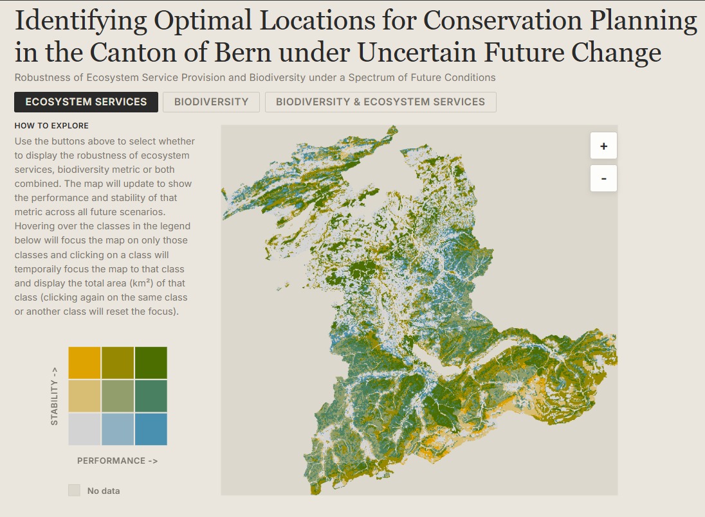

I have been spending a bit of time recently thinking about how to show uncertainty in a way that is actually useful. That sounds obvious enough, but in practice it is surprisingly easy to produce something that is technically correct and still very hard to read.

This little project was my attempt to make that problem feel a bit more tangible. The approach for quantifying robustness builds on the last paper of my PhD, which set out the underlying method in a more formal way in the accompanying [scientific publication](https://doi.org/10.1016/j.jenvman.2025.128395). We then developed that further as part of our work with the Canton of Bern through the broader [project website](https://bern-landscape-change-explorer.ethz.ch/), where the map sits alongside the wider scenario work.

The underlying data come from simulations of ecosystem services and biodiversity in the Canton of Bern under 225 future scenarios, combining alternative assumptions about land use, economic development, demographic change and climate change. Rather than collapse that into a single static figure, I wanted a small interactive map that would let someone explore where outcomes are not just strong, but robust.

The result is a browser-based bi-variate map that shows two dimensions at once: performance on the horizontal axis and stability on the vertical axis. The basic interaction is deliberately simple. You can switch between ecosystem services, biodiversity, or both combined, hover over any cell in the legend to focus the map on that class, and click to pin it and get the total area for that selection.

If you want to try it out, the map is live here: <https://blenback.github.io/interactive-bivariate-map/>.

## Starting from the data

One of the first design decisions was to keep the heavy lifting out of the browser. The classification work is done upstream in R and written out as GeoTIFFs and a small palette JSON. That means the web app does not need to calculate class breaks, colour scales or summary classes on the fly. It just needs to load already-classified rasters and render them reliably.

That separation turned out to be very helpful. The R side handles the analytical logic, while the JavaScript side focuses on interaction and presentation. I like this split because it keeps each part of the workflow doing what it is best at. R is where I am comfortable wrangling rasters and testing classification choices; the browser is where I want responsiveness.

There is also a practical benefit here: pre-classified rasters make the client code much easier to reason about. In `js/main.js`, each pixel already has a value from 1 to 9, so the rendering step becomes a matter of decoding those classes, assigning colours, and drawing the result quickly to a canvas.

## Making the map feel legible

Most of the work in a project like this is not really about drawing a map. It is about making the map understandable.

The HTML structure in `index.html` reflects that pretty directly. The map is only one part of the page. Alongside it is a compact sidebar with a legend, a short "how to explore" guide, a plain-language explanation of the two dimensions, and a methodology card for anyone who wants more detail. I wanted the interpretation help to live right next to the map rather than in a separate document that nobody opens.

The legend took more attention than I expected. Bi-variate maps are only useful if the reader can trust that the legend and the map are encoding things in exactly the same way. In `js/legend.js` and `js/main.js`, the colour lookup logic is mirrored so that the raster renderer and the legend resolve classes identically. That may sound like a small implementation detail, but it is the kind of thing that quietly determines whether an interface feels dependable or confusing.

Another small but important choice was to keep the interaction model very narrow. There are only three top-level views: ecosystem services, biodiversity, and the combined surface. Earlier in the workflow there are many possible scaling and classification decisions, but by the time the map reaches the browser those choices have already been made. I think that restraint helps. It keeps the viewer focused on interpretation rather than configuration.

## Hover, pin, zoom

Once the basic rendering was working, the next step was to make exploration feel lightweight. Hovering over a legend cell temporarily dims everything else on the map and highlights the chosen class. Clicking pins that class and overlays its total area directly on the legend. It is a small interaction, but it makes it much easier to answer questions like "where are the places that perform well but are unstable?" without forcing the user to mentally scan the entire raster.

The map itself is rendered to canvas for speed and then displayed inside an SVG wrapper that handles clipping, drag behaviour and zoom controls. That hybrid approach ended up feeling like a good compromise. The canvas is efficient for drawing a lot of raster pixels, while the SVG layer makes it straightforward to manage interactions and framing.

::: {.callout-note}
The most useful pattern in this project was probably not the map itself, but the division of labour behind it: analytical preparation in R, lightweight rendering in JavaScript, and explanatory text embedded directly in the interface.
:::

## A small map, but a useful one

I like projects like this because they sit in a nice middle ground between analysis and communication. The interesting part is not only whether the underlying metric is sound, but whether someone encountering it for the first time can actually make sense of it. For uncertainty-heavy environmental data, that matters a lot.

This map is still a fairly compact piece of work, but it already feels like a better way of engaging with the results than a static figure alone. It gives a quick visual overview, but it also invites a more specific kind of question: not just where things look good, but where they look good consistently.

That, in the end, was the point.
