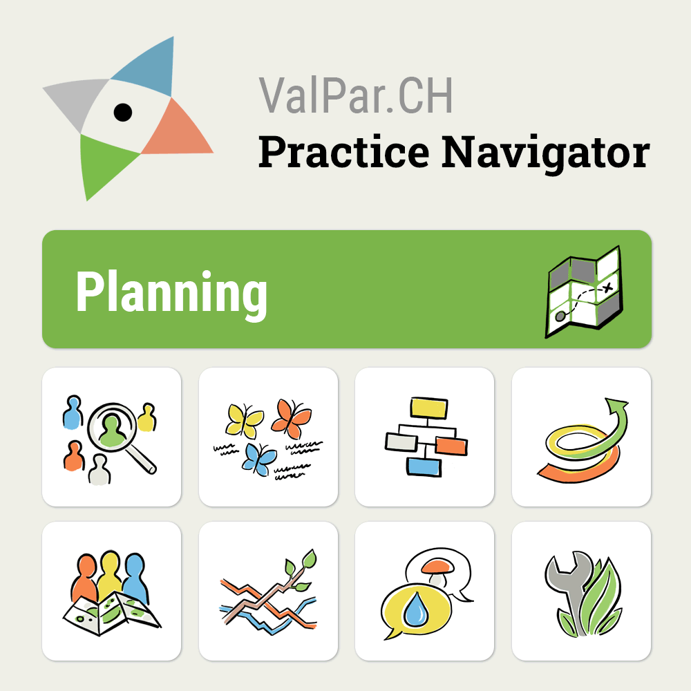

Every scientific project hopes to see its results used in practice and policy. In reality, bringing together the diverse outputs of large, interdisciplinary projects in an accessible and usable format remains a major challenge.

That’s why I’m excited to see the launch of the [ValPar.CH Praxis Navigator](https://valpar.ch/praxisnavigator/): a platform that brings together the research from the inter- and transdisciplinary ValPar.CH project and makes it accessible for planning, governance, and decision-making.

The navigator is structured around practice-relevant entry questions, supported by keywords and filters. Following the topic of *Planning*, for example, leads to several contributions I was involved in.

One example is the summary of the [Bern Landscape Change Explorer](https://valpar.ch/praxisnavigator/content/plan-landscape-10), a tool we developed to support the Canton of Bern in exploring how landscapes may evolve under different future scenarios—and what this means for biodiversity and ecosystem services.

This kind of scenario-based approach helps identify areas that remain valuable under changing conditions, supporting more robust and forward-looking conservation planning.

If you’re working in planning, nature conservation, or policy in Switzerland, the Praxis Navigator is a useful entry point to:

- Explore research-backed methods  
- Connect them to real-world use cases  
- Access the underlying scientific publications and data  

