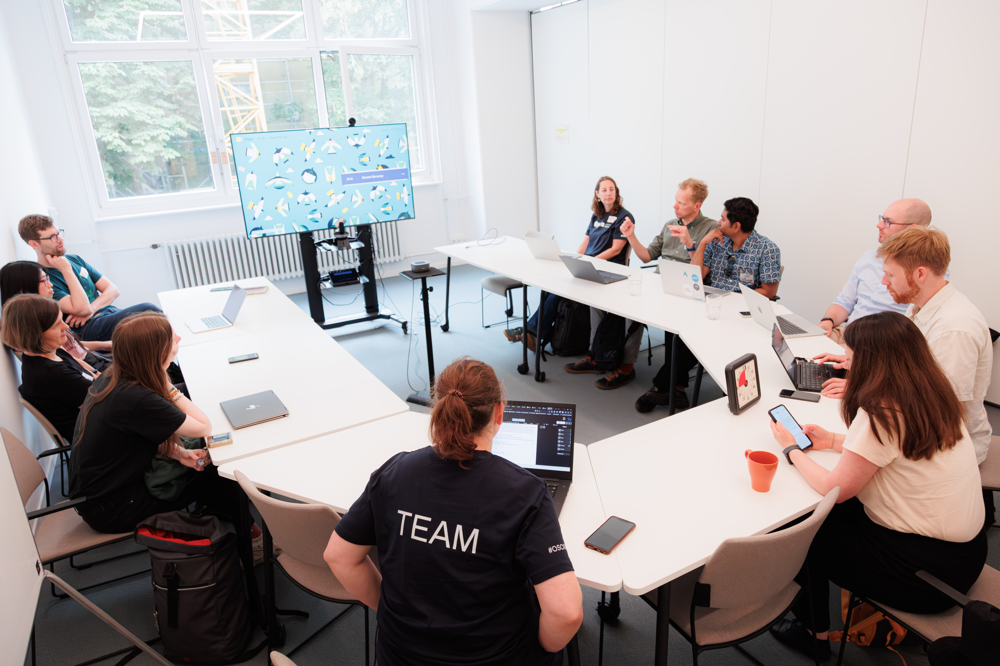
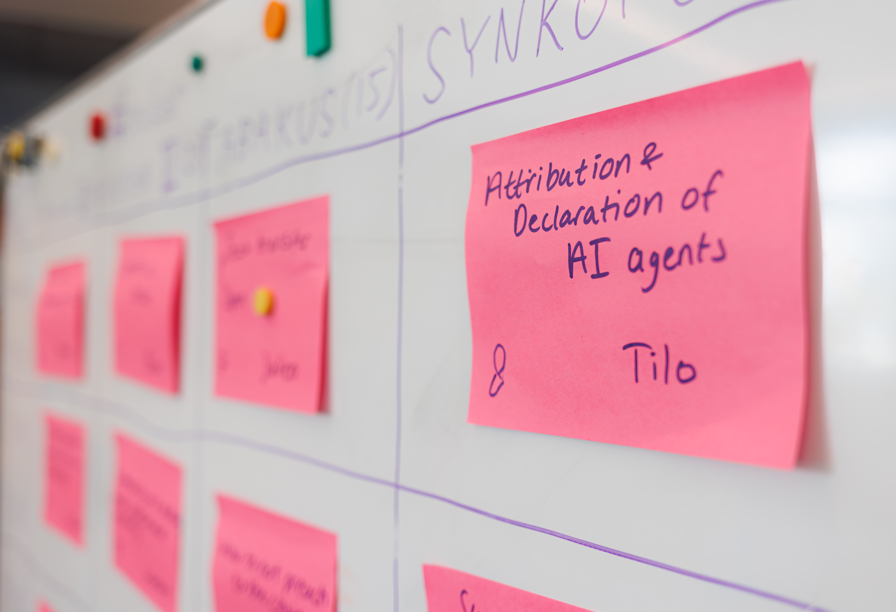
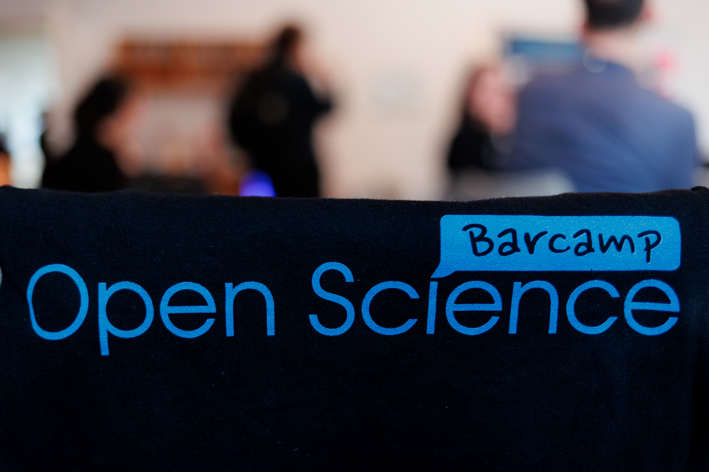
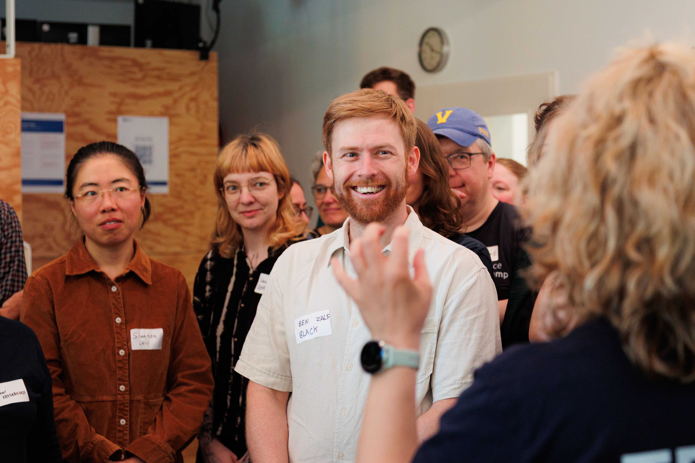
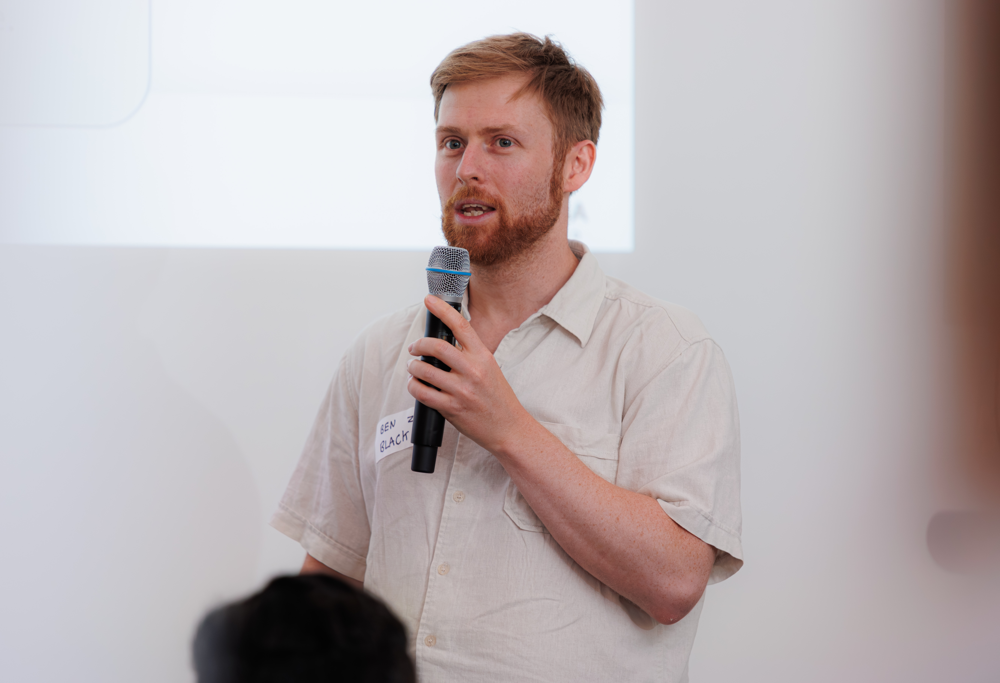

June was a busy month because in addition to the [World Biodiversity Forum in Davos](https://blenback.github.io/posts/2026-06-19-world-biodiversity-forum-wrap-up.html), I also attended the Barcamp Open Science in Berlin and the two events could not have been more different in terms of their format. Barcamps are a type of 'un-conference', which means that the agenda is not set in advance and participants are encouraged to propose and lead sessions on topics they are interested in. This creates a more participatory and collaborative environment, where attendees can really engage in discussions that are most relevant to them.

I came with a few ideas for sessions in my head but the one that I proposed, and ended up moderating (thankfully others thought it was interesting enough to vote for), was about effective carrot and stick approaches to incentivising Open Science within different institutional contexts. This is something that I have been interested in since my time as a PhD student where attending conferences and being part of committees was recognised (through ECTS credits) towards your degree but OPen Science activities such as publishing your data and research software were not.  

 The session was well attended, with participants from a range of disciplines and career stages, and we had a lively discussion about the challenges and opportunities for promoting Open Science in different contexts. A summary of the discussion will be provided as part of an overall wrap-up blog post from the organisers and I will link to that here once it is available. 

 The event itself was fantastic and I found the barcamp format to be a breath of fresh air compared to the traditional academic conference format (Mediocre plenary talks, I'm thinking of you!). If your work is in anyway related to Open Scienc eor if you are just interested in learning more, I would highly recommend attending the next barcamp if you have the opportunity.

::: {layout-nrow="2"}
{group="my-gallery"}

{group="my-gallery"}

{group="my-gallery"}

{group="my-gallery"}

{group="my-gallery"}
:::
* All photos from Barcamp Open Science 2026, attribution: Ralf Rebmann 2026.

<!-- Session blog post:
​​​​​​​Participants reflected on how institutions, funders, and journals are trying to encourage Open Science, and why these efforts still often fail to change everyday practice.
Many "carrots", such as recognition and career credit, were still seen as largely hypothetical because their promised benefits rarely materialise. For example, Open Science may be discussed during tenure-track hiring, but carries little weight in final decisions. Participants also noted that disciplines and institutions are at very different stages of Open Science adoption, meaning that no single incentive model will work everywhere.
At the same time, "sticks" such as funder mandates, legal obligations, and institutional expectations are often weakly enforced. Participants pointed to funder requirements for data management plans, which are rarely followed up or checked for compliance. Participants from ‘sticky’ institutions with top-down legal obligations also observed that staff still look for ways to avoid publishing data because they fear that imperfections will become visible.
The discussion concluded that both carrots and sticks remain necessary, but neither will be sufficient without broader cultural change. Participants highlighted that the pace of science may need to slow down rather than continually adding new expectations. To address ‘error culture’, they suggested promoting the idea, in the spirit of George Box, that "all data are imperfect, but some data are useful". Finally, participants argued that researchers should be more confident in badging their work as Open Science and framing it as a fundamental component of good science.

 -->

