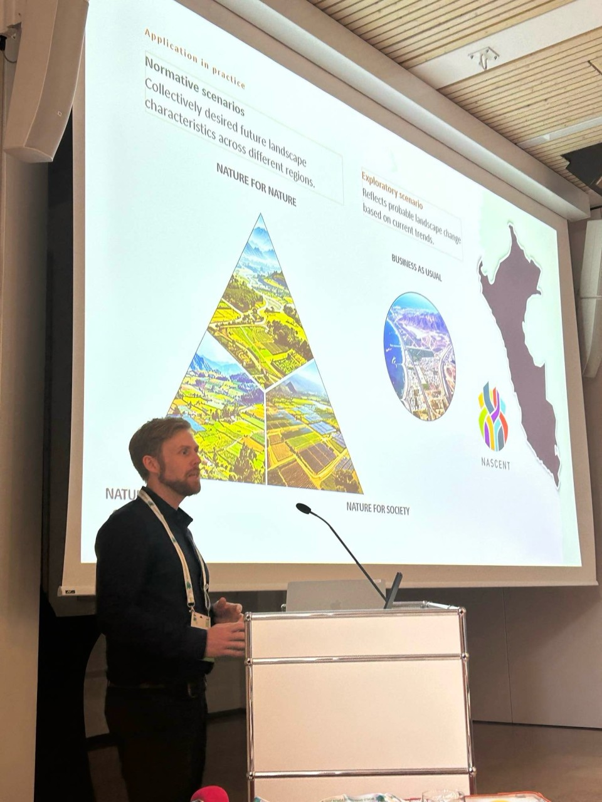
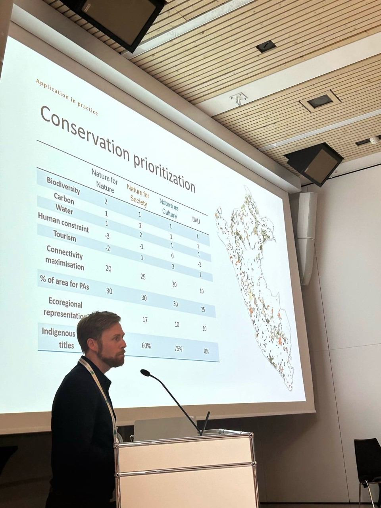
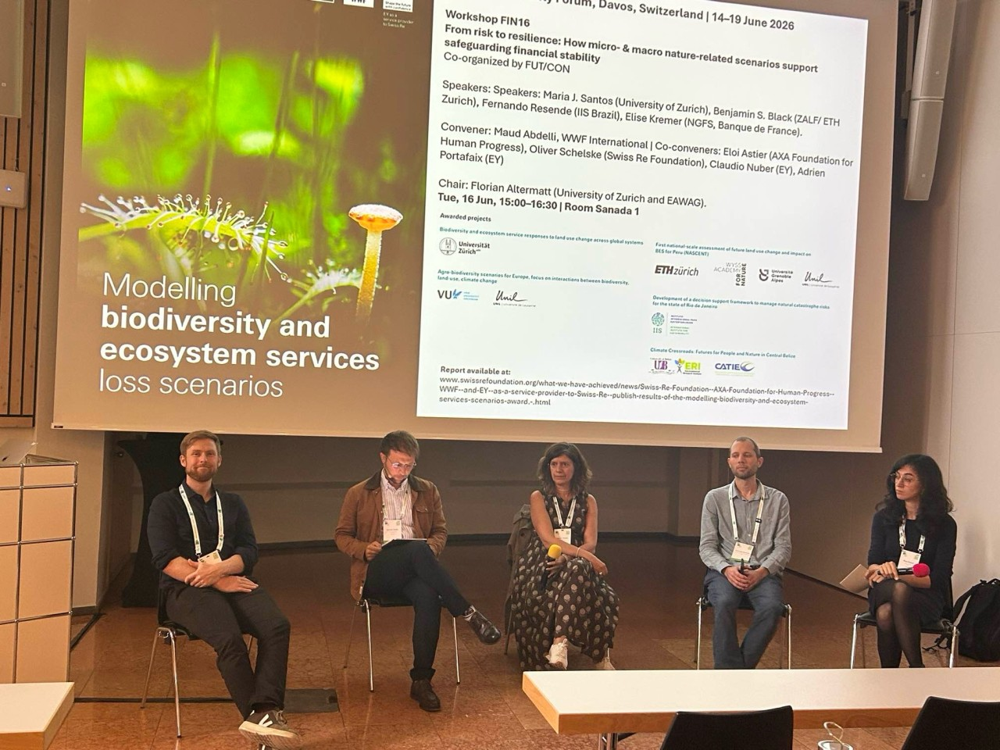
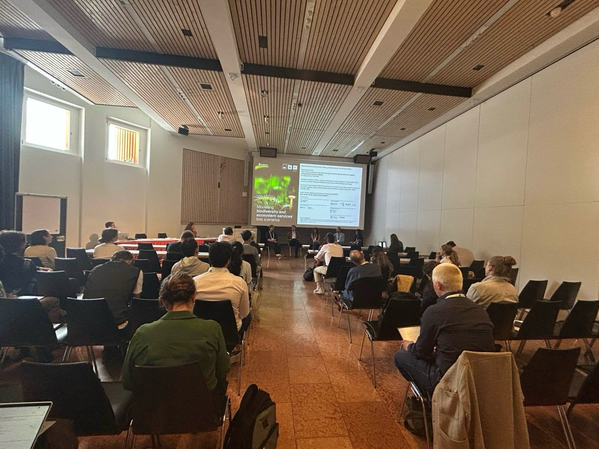

Last week I was back in Davos for the 2026 edition of the World Biodiversity Forum. This is my second time attending having first gone in 2024. It always feels like an intensive week as the schedule is packed with plenary talks, presentations, workshops and poster sessions, but it is very rewarding as it brings together researchers and practitioners working on biodiversity from a huge range of perspectives spanning from traditional ecologists, system thinkers, artists, as well as finance. 

This time I had a fuller program. I gave two presentations: [Insights from the development of national scale Nature Futures Framework scenarios in both Switzerland and Peru](../presentations/2026_06_16_WBF_NFF.qmd), as part of a session on applying the Nature Futures Framework from local to national scales, and [Scenario-modelling to secure biodiversity and ecosystem services under uncertainty](../presentations/2026_06_16_WBF_panel.qmd), given in a workshop and panel discussion on how nature-related scenarios can support financial stability.

I also had the pleasure of chairing a session for the first time that I co-convened with my former PhD supervisers Adrienne Grêt-Regamey and Peter Verburg: *Rethinking static spatial planning for biodiversity conservation in a rapidly changing world*. Our aim with this session was to bring together examples of how we can move spatial conservation planning forward in terms of incorporating data and methods that reflect the expected future impacts on biodiversity and ecosystem services from drivers such as climate and land use change as well as including diverse social perspectives on what should be conserved and what actions are preferable.   

We had three excellent talks in the session alongside several poster submissions, the abstracts of which are available in the conference preceedings in the coming weeks. 

Here are a few photos from the week.

::: {layout-nrow=2}
{group="my-gallery"}

{group="my-gallery"}

{group="my-gallery"}

{group="my-gallery"}
:::
